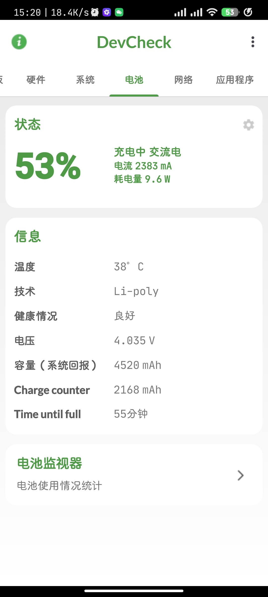
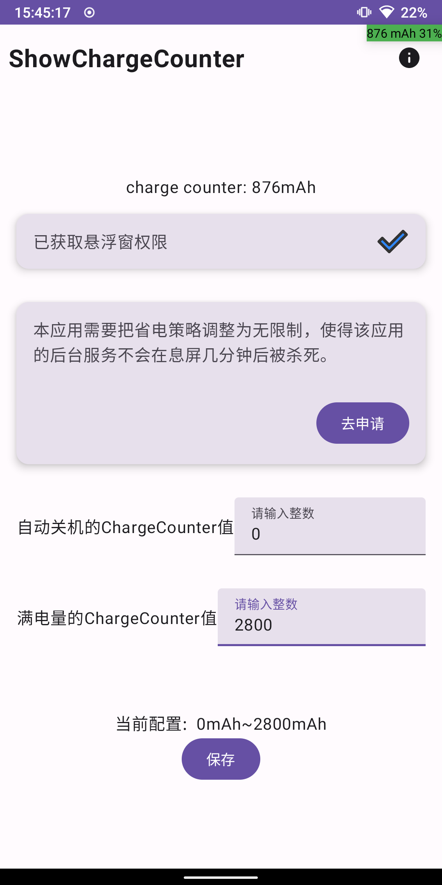

# ShowChargeCounter

## 介绍

你是否遇到过还剩10%电量时光速自动关机，是否遇到过快要付款时突然黑屏，是否遇到过电量不降反增、系统显示电量异常？  

如果你遇到以上情况，我希望你能直接去换一块电池。如果不幸地，你拿不出去换电池的时间，那么很幸运，这款软件或许能帮上你的忙。  

这款软件通过手动设定最大最小ChargeCounter，去计算剩余电量和百分比，并显示在屏幕上。  

## 背景

RedMi K40在电池老化后，会出现电量百分比卡在1%的情况，以上的情况我全都遇到过。电量会乱跳，40%的电可能就会关机，我经常在排队时突然手机黑屏。  

## 下载

https://atomgit.com/dreamsoul/ShowChargeCounter/tags?tab=release  

> 如果你不知道下载什么版本，可以选择带有`arm64-v8a`字样的版本，如果是上古神机，则选择armeabi-v7a（32位架构）

## 使用方法

使用之前我们有必要说一下ChargeCounter这个参数，正如其名，他叫做`充电计数器`。你不需要对它进行过多的了解，只需要知道：  

- 当充电时，ChargeCounter的值会变大
- 当耗电时，ChargeCounter的值会减小

那么此时，你可能觉得这不就是电量吗。实际上还是有偏差的，尤其是已经不够健康的电池。那么你可能已经想到了，我们以以下的方式设定最大值和最小值：  

- 当充电的时间足够长，ChargeCounter不再增加或者增加得非常缓慢，我们拔下充电器后查看ChargeCounter（拔下后可能会跳电，因此拔下后再看）。使用该值作为最大值（单位是mAh）。  
- 当电量较低时，我们在自动关机前查看ChargeCounter的值。使用该值作为最小值。

### 简略版

1. 授予悬浮窗权限和后台权限
2. 设定最大值和最小值

> 电量会显示在右上角，动态刷新，你不必重启应用，只需稍等片刻。  
>
> 程序没做什么错误处理，因此如果你设定了不恰当的值，电量百分比会显示比较离谱的值。但是这并没有什么风险，这款应用是安全的。  

### 查看ChargeCounter

使用DevCheck或者给本应用悬浮窗权限后，就能够查看ChargeCounter。  

